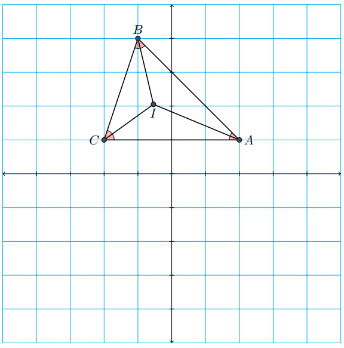

`euclid` is little project of mine that I've been working on for the past few weeks. It's a set of python scripts 
that lets you do analytic geometry in `python`. You can also draw TikZ diagrams using `tikz_draw.py`. It's a work in progress and 
therefore it can't do much. So far it can only handle `Line`, `Segment` and `Ray`. 
(Geometric objects are defined using *parametric equations*.)

# Example Usage
```python
from euclid2 import *
from tikz_draw import *

A=col_vector([2,1])
B=col_vector([-1,4])
C=col_vector([-2,1])

bisector1=angle_bisector(A,B,C)
bisector2=angle_bisector(B,C,A)
#angle bisector of angle ABC and angle BCA

I=bisector1.intersection(bisector2)
# intersection of bisector1 and bisector2
# I is the incenter of trinagle ABC

tikz=Tikz('triangle.tex')

tikz.begin('document')
tikz.begin('tikzpicture')

tikz.draw_grid(xy_range=[-5,5])
tikz.draw_axis()

tikz.draw_angle(A,C,B, radius=0.3)
tikz.draw_angle(A,B,C, radius=0.3)
tikz.draw_angle(B,A,C, radius=0.3)

tikz.draw_path(A,B,C,cycle=True)
tikz.draw_path(I,A)
tikz.draw_path(I,B)
tikz.draw_path(I,C)

tikz.draw_points(A,B,C,I)

tikz.end('tikzpicture')
tikz.end('document')

tikz.pdf() 
#This will compile the TeX file using pdfLaTeX
```
*Output: *

