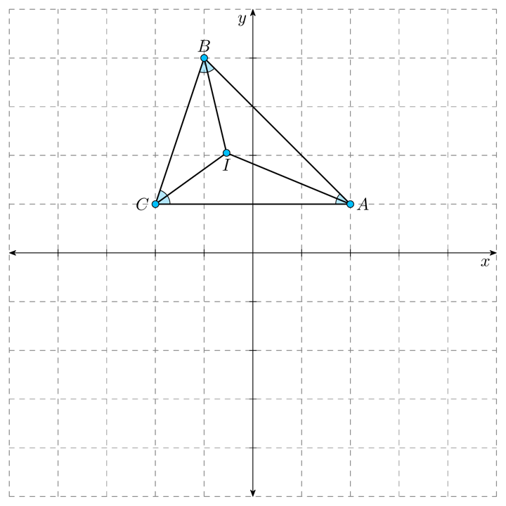
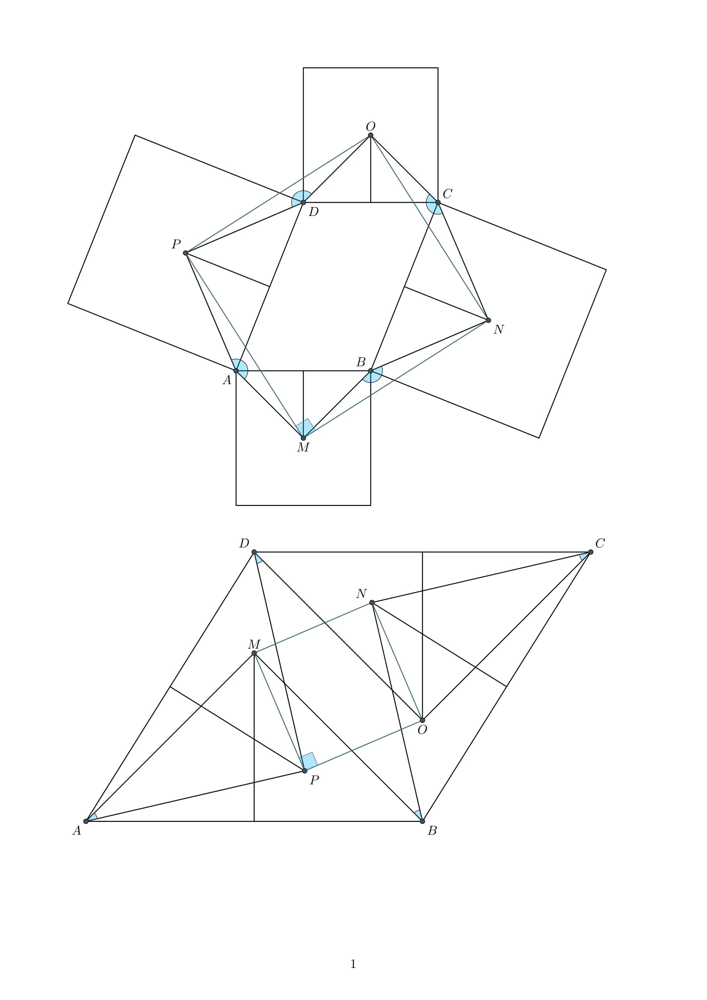

`euclid` is little project of mine that I've been working on for the past few weeks. It's a set of python scripts 
that lets you do analytic geometry in `python`. You can also draw TikZ diagrams using `tikz_draw.py`. 
**It's a work in progress and therefore it can't do much.** 
(Geometric objects are defined using *parametric equations*.) \
The following python packages are required to use `euclid`,

* Numpy
* pdf2image 

To use `tikz_draw.py` you have to have `LaTeX` and `tikz` package installed.
# Example Usage

```python
from euclid import *

A=col_vector([2,1])
B=col_vector([-1,4])
C=col_vector([-2,1])

bisector1=angle_bisector(A,B,C)
bisector2=angle_bisector(B,C,A)
#angle bisector of angle ABC and angle BCA

I=bisector1.intersection(bisector2)
# intersection of bisector1 and bisector2
# I is the incenter of trinagle ABC

tikz=Tikz('triangle.tex')

tikz.begin('document')
tikz.begin('tikzpicture')

tikz.draw_grid(x_range=[-5,5], y_range=[-5,5])
tikz.draw_axis(x_range=[-5,5], y_range=[-5,5])

tikz.draw_angle(A,C,B, radius=0.3)
tikz.draw_angle(A,B,C, radius=0.3)
tikz.draw_angle(B,A,C, radius=0.3)

tikz.draw_path(A,B,C,cycle=True)
tikz.draw_path(I,A)
tikz.draw_path(I,B)
tikz.draw_path(I,C)

tikz.draw_points(A,B,C,I)

tikz.node(A, node_config="anchor=west",text=r"$A$")
tikz.node(B, node_config="anchor=south",text=r"$B$")
tikz.node(C, node_config="anchor=east",text=r"$C$")
tikz.node(I, node_config="anchor=north",text=r"$I$")

tikz.end('tikzpicture')
tikz.end('document')

tikz.pdf()
#This will compile the TeX file using pdfLaTeX
```

**Output:**



```python
from euclid import *

A=origin
B=col_vector([3,3])

c1=Circle(A, 2)
c2=Circle(B, 1)

T=common_tangents(c1, c2)

tikz=Tikz('common_tangents.tex')

tikz.begin('document')
tikz.begin('tikzpicture')

tikz.draw_circle(c1, config="cyan!50!black, thick")
tikz.draw_circle(c2, config="cyan!50!black, thick")

tikz.draw_line(T[0], x_range=[-8,8], y_range=[-8,8])
tikz.draw_line(T[1], x_range=[-8,8], y_range=[-8,8])
tikz.draw_line(Line(c1.center, c2.center), config="gray", x_range=[-8,8], y_range=[-8,8])
tikz.draw_path(c1.center, T[0] & T[1])

c1T0=intersection_line_circle(T[0], c1)[0]
c2T0=intersection_line_circle(T[0], c2)[0]

tikz.draw_path(c1.center, c1T0)
tikz.draw_path(c2.center, c2T0)

tikz.draw_points(c1.center, c2.center, T[0] & T[1], c1T0, c2T0)

tikz.node(c1.center, node_config="anchor=north, inner sep=8pt", text="$C_2$")
tikz.node(c2.center, node_config="anchor=north, inner sep=8pt", text="$C_1$")

tikz.node(c2T0, node_config="anchor=south, inner sep=8pt", text="$T_1$")
tikz.node(c1T0, node_config="anchor=south, inner sep=8pt", text="$T_2$")

tikz.node(mid(c2T0, c2.center)-col_vector((0,0.25)), node_config="anchor=east, inner sep=2pt", text="$r_1$")
tikz.node(mid(c1T0, c1.center), node_config="anchor=east, inner sep=4pt", text="$r_2$")

tikz.node(T[0] & T[1], node_config="anchor=north, inner sep=5pt", text="$P$")

tikz.end('tikzpicture')
tikz.end('document')

tikz.pdf()
```

**Output:**


```python
from euclid import *


def square_on_side(A, B):
    b = B - A
    a = origin
    d = dist(A, B)
    theta = angle_between_vectors(x_vect, b) - 90
    C = polar( sqrt(2)*d, theta + 45) + A
    D = polar(d, theta) + A
    return [A, B, C, D]

def square_center(A, B):
    C, D = square_on_side(A, B)[2:]
    AC = Line(A, C)
    BD = Line(B, D)
    return AC & BD

tikz=Tikz("sqr_center.tex")
tikz.begin("document")

tikz.begin("figure", config="!h")
tikz.begin("tikzpicture")

A = col_vector([0, 0])
B = col_vector([4, 0])
C = col_vector([6, 5])
D = col_vector([2, 5])

mAB = mid(A, B)
mBC = mid(B, C)
mCD = mid(C, D)
mDA = mid(D, A)

tikz.draw_path(*square_on_side(B, C), cycle=True)
tikz.draw_path(*square_on_side(A, B), cycle=True)
tikz.draw_path(*square_on_side(C, D), cycle=True)
tikz.draw_path(*square_on_side(D, A), cycle=True)

M, N, O, P = square_center(A, B), square_center(B, C), square_center(C, D), square_center(D, A)

tikz.draw_path(A, M, B)
tikz.draw_path(B, N, C)
tikz.draw_path(C, O, D)
tikz.draw_path(D, P, A)

tikz.draw_path(mAB, M)
tikz.draw_path(mBC, N)
tikz.draw_path(mCD, O)
tikz.draw_path(mDA, P)

tikz.draw_path(M, N, O, P, cycle=True, config="thick, cyan!40!black")

tikz.draw_angle(M, B, N, radius=.35)
tikz.draw_angle(O, C, N, radius=.35)
tikz.draw_angle(O, D, P, radius=.35)
tikz.draw_angle(M, A, P, radius=.35)
tikz.draw_angle(N, M, P, radius=.60, config="cyan!40!black")

tikz.draw_points(A, B, C, D)
tikz.draw_points(M, N, O, P)

tikz.node(A, node_config="anchor= north east", text="$A$")
tikz.node(B, node_config="anchor= south east", text="$B$")
tikz.node(C, node_config="anchor= south west", text="$C$")
tikz.node(D, node_config="anchor= north west", text="$D$")

tikz.node(M, node_config="anchor= north", text="$M$")
tikz.node(N, node_config="anchor= north west", text="$N$")
tikz.node(O, node_config="anchor= south", text="$O$")
tikz.node(P, node_config="anchor= south east", text="$P$")

tikz.end("tikzpicture")
tikz.end("figure")

tikz.begin("figure", config="!h")
tikz.begin("tikzpicture")

A = col_vector([0, 0])
B = col_vector([10, 0])
C = col_vector([15, 8])
D = col_vector([5, 8])

mAB = mid(A, B)
mBC = mid(B, C)
mCD = mid(C, D)
mDA = mid(D, A)

M, N, O, P = square_center(B, A), square_center(C, B), square_center(D, C), square_center(A, D)

tikz.draw_path(A, M, B)
tikz.draw_path(B, N, C)
tikz.draw_path(C, O, D)
tikz.draw_path(D, P, A)

tikz.draw_path(mAB, M)
tikz.draw_path(mBC, N)
tikz.draw_path(mCD, O)
tikz.draw_path(mDA, P)

tikz.draw_path(M, N, O, P, cycle=True, config="thick, cyan!40!black")

tikz.draw_angle(N, B, M, radius=.35)
tikz.draw_angle(M, C, O, radius=.35)
tikz.draw_angle(P, D, O, radius=.35)
tikz.draw_angle(P, A, M, radius=.35)
tikz.draw_angle(O, P, M, radius=.60, config="cyan!40!black")

tikz.draw_path(A, B, C, D, cycle=True)
tikz.draw_points(A, B, C, D)
tikz.draw_points(M, N, O, P)

tikz.node(A, node_config="anchor= north east", text="$A$")
tikz.node(B, node_config="anchor= north west", text="$B$")
tikz.node(C, node_config="anchor= south west", text="$C$")
tikz.node(D, node_config="anchor= south east", text="$D$")

tikz.node(M, node_config="anchor= south", text="$M$")
tikz.node(N, node_config="anchor= south east", text="$N$")
tikz.node(O, node_config="anchor= north", text="$O$")
tikz.node(P, node_config="anchor= north west", text="$P$")

tikz.end("tikzpicture")
tikz.end("figure")

tikz.end("document")
tikz.pdf()
```
**Output:**


